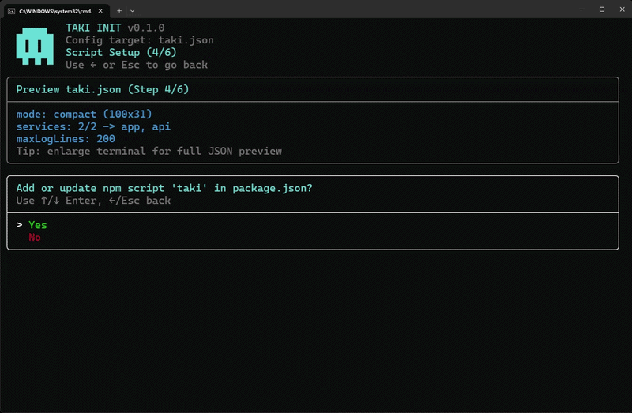
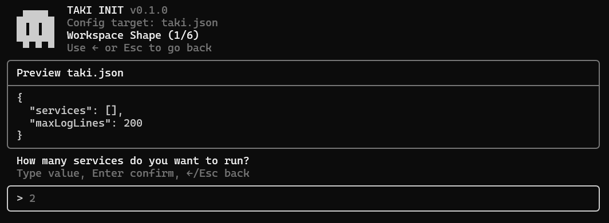
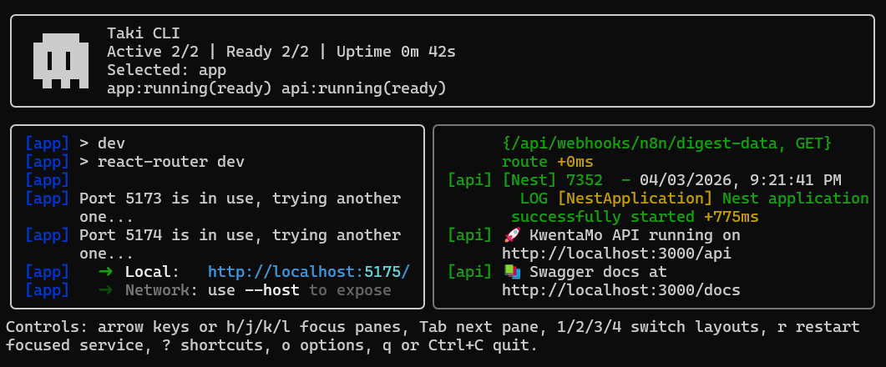

<table>
  <tr>
    <td width="180" valign="top">
       </br>
      </br>
      
    </td>
    <td valign="top">
      <h1>Taki CLI</h1>
      <p>Taki is a terminal dashboard for running multiple local services in one place.</p>
      <p>It helps you:</p>
      <ul>
        <li>start and monitor many services from one command</li>
        <li>see logs in a single UI</li>
        <li>restart a focused service quickly</li>
        <li>scaffold <code>taki.json</code> with an interactive wizard</li>
      </ul>
    </td>
  </tr>
</table>

## Showcase



### Sample Images

| `taki init` sample                                          | `taki run` sample                                            |
| ----------------------------------------------------------- | ------------------------------------------------------------ |
|  |  |

## Install

### Global

```bash
npm install -g @kwiruu/taki-cli
```

### Local dev

```bash
npm install
npm run build
```

## Quick Start

1. Open your project folder.
2. Run the setup wizard:

```bash
taki init
```

3. Start dashboard:

```bash
taki run
```

You can also run simply:

```bash
taki
```

## Common Commands

```bash
taki init
taki run
taki config --config ./taki.json
taki add --name app --command npm --args "run dev"
taki version
taki v
taki --version
taki -v
taki --config ./taki.json
taki run --config ./taki.json
```

## Interactive Init

`init` generates a `taki.json` file through guided prompts.

It supports:

- back navigation with Left Arrow or Esc
- live config preview
- compact preview mode for small terminals
- optional `package.json` script setup (`scripts.taki`)

Flags:

- `--config <path>`: choose output path
- `--force`: overwrite without prompt

## Dashboard Controls

### Core

- `q` or `Ctrl+C`: quit and shutdown all services
- `r`: restart focused service
- `o`: open options
- `?`: show shortcut commands panel

### Layout shortcuts

- `1`: single pane
- `2`: vertical panes
- `3`: horizontal panes
- `4`: grid panes

### Single-pane mode

- `Up/Down` or `j/k`: select service log stream

### Split and grid modes

- Arrow keys or `h/j/k/l`: move pane focus
- `Tab`: jump to next pane

### Full-log view

- Open via `o` -> Full log
- `Esc`: return to dashboard

### Shortcuts panel

- Open with `?`
- `Esc` or `?`: close panel

## Layout Options

Use `o` to open options and configure layout:

- single pane
- vertical panes (configurable count)
- horizontal panes (configurable count)
- grid panes (configurable columns and rows)

## Theme Options

Use `o` -> `Choose theme` while running the dashboard.

Available presets include both VS Code-like and terminal themes, such as:

- VS Code: Dark+, Light+, Monokai, GitHub Dark, GitHub Light
- Terminal: Gruvbox Dark, Solarized Dark/Light, Nord, Dracula, One Dark

Theme choice is saved into `taki.json` under `ui.theme`.

## Config Command

Print validated current config:

```bash
taki config
taki config --config ./taki.json
```

## Add Service Command

Add a service to your `taki.json` interactively:

```bash
taki add
```

Or use flags:

```bash
taki add --name app --command npm --args "run dev" --cwd ./kwenta-mo-app --color magenta
```

Useful flags:

- `--config <path>`: choose config file path
- `--name <name>`: service name
- `--command <command>`: executable command
- `--args "..."`: argument string
- `--cwd <path>`: working directory
- `--color <color>`: one of red, green, yellow, blue, magenta, cyan, white, gray
- `--start-after <names>`: comma-separated dependencies
- `--yes`: skip prompts, require essential flags

## Version

```bash
taki version
taki v
taki --version
taki -v
```

## Config File (`taki.json`)

Example:

```json
{
  "services": [
    {
      "name": "web",
      "command": "npm",
      "args": ["run", "dev"],
      "color": "green",
      "healthCheck": {
        "type": "log",
        "pattern": "ready"
      }
    },
    {
      "name": "api",
      "command": "uvicorn",
      "args": ["main:app", "--reload", "--port", "8000"],
      "color": "yellow",
      "startAfter": ["web"],
      "healthCheck": {
        "type": "http",
        "url": "http://127.0.0.1:8000/health",
        "intervalMs": 500,
        "timeoutMs": 20000
      }
    }
  ],
  "maxLogLines": 200,
  "ui": {
    "theme": "vscode-dark-plus"
  }
}
```

## Service Fields

- `name`: label shown in dashboard
- `command`: executable to run
- `args`: optional argument array
- `color`: label color
- `cwd`: optional working directory
- `env`: optional extra environment variables
- `startAfter`: optional dependency list
- `healthCheck`: optional readiness gate

## Health Checks

### Log health check

```json
{
  "type": "log",
  "pattern": "ready",
  "timeoutMs": 20000
}
```

### HTTP health check

```json
{
  "type": "http",
  "url": "http://127.0.0.1:3000/health",
  "intervalMs": 500,
  "timeoutMs": 20000
}
```

## Publish

```bash
npm run release:check
npm version patch
git push
git push --tags
```

## Release Automation

- CI runs on push/PR across Node LTS matrix and executes `npm run release:check`.
- Release Please creates release PRs from merged commits on `main`.
- If a release PR is already open, new commits pushed to `main` update that same PR (version + changelog) automatically.
- Version tags and npm publish only happen after the release PR is merged.
- Pushing a version tag like `v0.1.1` triggers automated npm publish.

### GitHub Secrets Required

- `NPM_TOKEN`: npm automation token with publish access to `@kwiruu/taki-cli`
- `RELEASE_PLEASE_TOKEN` (optional fallback): GitHub PAT for creating release PRs when Actions cannot use `GITHUB_TOKEN` to open pull requests.

### GitHub Actions Settings Required

In repository settings:

1. Settings -> Actions -> General
2. Workflow permissions: **Read and write permissions**
3. Enable: **Allow GitHub Actions to create and approve pull requests**

If your organization blocks this setting, create a fine-grained PAT and save it as `RELEASE_PLEASE_TOKEN`.

### How To Create NPM_TOKEN

1. Open npmjs.com and sign in with the account that can publish `@kwiruu/taki-cli`.
2. Go to Account Settings -> Access Tokens.
3. Create a new token for CI publishing (automation or granular publish token).
4. Copy the token once, then add it in GitHub: Settings -> Secrets and variables -> Actions -> New repository secret.
5. Secret name: `NPM_TOKEN`.
